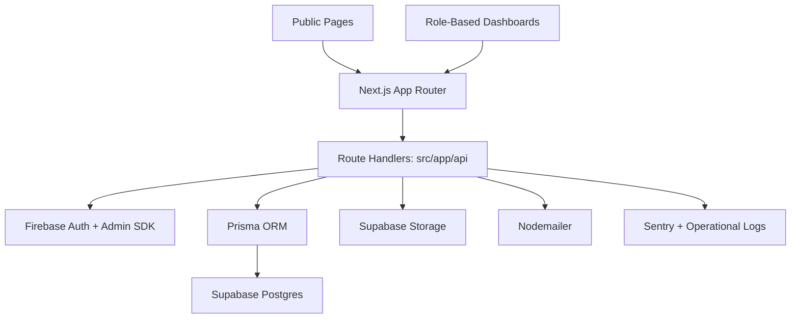

# MPhil/PhD Lifecycle Management System

A full-stack academic operations platform for managing the postgraduate research journey, including applications, registrations, proposals, milestone progress reports, thesis submissions, vivas, corrections, and administrative review workflows.

**[Project Overview](./PROJECT_OVERVIEW.md)** | **[Project Documentation](./docs/)** | **[Test Suite](./tests/)**

---

## Table of Contents

- [Overview](#overview)
- [System Scope](#system-scope)
- [User Roles](#user-roles)
- [Key Capabilities](#key-capabilities)
  - [Students](#students)
  - [Supervisors](#supervisors)
  - [Examiners](#examiners)
  - [Administrators](#administrators)
- [Tech Stack](#tech-stack)
- [System Architecture](#system-architecture)
- [Quick Start](#quick-start)
  - [Prerequisites](#prerequisites)
  - [Installation](#installation)
  - [Environment Configuration](#environment-configuration)
  - [Database Setup](#database-setup)
  - [Development Server](#development-server)
- [Repository Structure](#repository-structure)
- [Frontend Structure](#frontend-structure)
- [API Overview](#api-overview)
- [Core Business Areas](#core-business-areas)
- [Data and Validation](#data-and-validation)
- [Environment Variables](#environment-variables)
- [Testing and Quality Assurance](#testing-and-quality-assurance)
- [Documentation](#documentation)
- [License](#license)

---

## Overview

The **MPhil/PhD Lifecycle Management System** is a role-based academic operations platform designed to manage the postgraduate research journey within a unified software architecture.

Rather than operating solely as a student portal, the platform integrates:
- Public-facing admissions and application intake.
- Role-restricted dashboards for academic and administrative stakeholders.
- Postgraduate workflow management and status tracking.
- Document submission, versioning, and verification handling.
- Administrative coordination for supervisors, examiners, and department leadership.

The objective of the system is to replace fragmented paper forms, uncoordinated email exchanges, and manual document tracking with a secure, audit-logged platform featuring shared validation, workflow tracking, and lifecycle transparency.

---

## System Scope

The platform covers the complete postgraduate lifecycle:

1. **Public Application & Intake:** Applicants submit proposals and supporting documentation.
2. **Supervisor Consent & Proposal Review:** Proposed supervisors record consent, and assigned reviewers evaluate the proposal.
3. **Department Admission:** Head of Department (HOD) makes admission decisions, and the Postgraduate Coordinator executes approved admissions.
4. **Registration & Milestone Generation:** Admission creates a single active registration with structured milestone schedules (M1–M4, M1–M6, or M1–M9) based on programme and study mode.
5. **Milestone Progress Submissions:** Students submit milestone reports for primary supervisor review and approval.
6. **Thesis & Examination Gates:** Ethics checks and thesis-readiness clearance precede exact-version examiner assignments.
7. **Viva & Evaluation:** Examiners submit independent evaluation reports; the HOD records viva outcomes and orders required corrections.
8. **Completion & Archive:** Academic completion requires clearance of all milestones, ethics gates, thesis requirements, and viva outcomes. Program completion, graduation confirmation, and archival remain controlled administrative steps.

---

## User Roles

| Role | Main Responsibilities |
|---|---|
| **Student** | Submit proposals, progress reports, theses, and corrections while tracking academic progress. |
| **Supervisor** | Record supervisor consent, review assigned proposals, and approve milestone reports. |
| **Examiner** | Review assigned proposal/thesis versions and submit independent recommendations. |
| **Administrator** | Manage intake, user accounts, supervisor/examiner assignments, scheduling, completion, and operational reporting. |
| **Head of Department (HOD)** | Execute department admission decisions, examiner confirmations, viva outcome approvals, and academic completions. |

---

## Key Capabilities

### Students
- Public application submission and status tracking.
- Authenticated portal access and role dashboard.
- Research proposal submission with version management.
- Periodic progress report submission.
- Thesis submission and correction upload tracking.

### Supervisors
- Assigned student roster and profile management.
- Proposal evaluation workflows.
- Progress report review, return, and approval.
- Supervision oversight across assigned candidates.

### Examiners
- Dedicated examination workspace.
- Viva evaluation and recommendation submission.
- Version-bound thesis review.

### Administrators
- Account lifecycle management (creation, role assignment, deactivation).
- Application intake and processing workflows.
- Examiner and supervisor assignment coordination.
- Viva scheduling and administrative logistics.
- System auditing and operational reporting.

---

## Tech Stack

| Component | Technology |
|---|---|
| **Frontend** | Next.js 14 App Router, React 18, TypeScript |
| **Styling** | Tailwind CSS |
| **Backend** | Next.js Route Handlers |
| **Database** | Supabase PostgreSQL + Prisma ORM |
| **Authentication** | Firebase Auth + Firebase Admin SDK |
| **File Storage** | Supabase Storage |
| **Validation** | Zod |
| **Email Service** | Nodemailer |
| **Data Fetching** | SWR |
| **Monitoring** | Sentry |
| **Testing** | Vitest, Testing Library, Playwright |

---

## System Architecture

The architecture connects public intake pages, role-based dashboards, backend API handlers, relational database storage, authentication, object storage, and background processing.



Layered Representation:

```text
+------------------------------------------------------------+
|                       CLIENT LAYER                         |
|         Next.js App Router · React · Tailwind CSS          |
+---------------------------+--------------------------------+
                            | HTTP / API
+---------------------------v--------------------------------+
|                    APPLICATION LAYER                       |
|                  Next.js Route Handlers                    |
|                                                            |
|  Auth · Applications · Dashboard · Proposals · Progress    |
|  Reports · Theses · Vivas · Assignments · Notifications    |
+---------------------------+--------------------------------+
                            | Prisma ORM / SDKs
+---------------------------v--------------------------------+
|                       SERVICE LAYER                        |
|  Prisma · Firebase Admin · Supabase Storage · Nodemailer   |
+---------------------------+--------------------------------+
                            |
+---------------------------v--------------------------------+
|                         DATA LAYER                         |
|              Supabase Postgres + Supabase Storage          |
+------------------------------------------------------------+
```

---

## Quick Start

### Prerequisites

* Node.js `18.17.0` or higher (Node.js `24.x` recommended)
* `npm` package manager
* PostgreSQL database instance (local or Supabase)
* Firebase project credentials
* Supabase project and storage bucket

### Installation

```bash
git clone https://github.com/cepdnaclk/e23-co2060-MPhil-PhD-Lifecycle-Management-System.git
cd e23-co2060-MPhil-PhD-Lifecycle-Management-System
npm install
```

### Environment Configuration

Create a `.env` file in the root directory:

```bash
cp .env.example .env
```

Populate `.env` with required credentials for PostgreSQL, Firebase, Supabase, and SMTP.

### Database Setup

1. Generate Prisma Client bindings:
   ```bash
   npm run prisma:generate
   ```

2. Run database migrations:
   ```bash
   npm run prisma:migrate
   ```

### Development Server

Start the local development server:

```bash
npm run dev
```

The application will be accessible at `http://localhost:3000`.

---

## Repository Structure

```text
e23-co2060-MPhil-PhD-Lifecycle-Management-System/
│
├── src/
│   ├── app/                    # App Router pages, layouts, and API routes
│   ├── components/             # Reusable and domain-specific UI components
│   │   ├── admin/
│   │   ├── application/
│   │   ├── auth/
│   │   ├── dashboard/
│   │   ├── examiner/
│   │   ├── progress-reports/
│   │   ├── proposals/
│   │   ├── student/
│   │   ├── supervisor/
│   │   └── ui/
│   ├── lib/                    # Business logic, integrations, validation
│   └── types/                  # Shared TypeScript types
│
├── prisma/                     # Prisma schema and database migrations
├── tests/                      # Unit, integration, and e2e test suites
├── docs/                       # Architectural documentation and guides
├── images/                     # Static image assets
├── scripts/                    # Maintenance and operational scripts
├── PROJECT_OVERVIEW.md         # Detailed system overview
└── README.md                   # Repository README
```

---

## Frontend Structure

The application separates public user flows from internal management:

### Public Routes

| Route | Purpose |
|---|---|
| `/` | Landing page |
| `/apply` | Postgraduate application submission |
| `/apply/success` | Application submission confirmation |
| `/login` | Authentication portal |

### Internal Dashboards

Role-restricted dashboards reside under `/dashboard`:

- `/dashboard/student` — Student academic progress portal
- `/dashboard/supervisor` — Supervisor management workspace
- `/dashboard/examiner` — Examination workspace
- `/dashboard/admin` — Administrative operations suite

The common dashboard shell is implemented in `src/components/dashboard/dashboard-role-layout.tsx`.

---

## API Overview

Backend route handlers are defined in `src/app/api`. Primary domains include:

| Domain | Key Functionality |
|---|---|
| `/api/auth` | Authentication and session token verification |
| `/api/applications` | Public application intake and processing |
| `/api/admin/users` | User management, role updates, and filtering |
| `/api/proposals` | Proposal submission and version management |
| `/api/progress/milestones` | Milestone report submissions and approvals |
| `/api/theses` | Thesis record creation and document handling |
| `/api/vivas` | Viva scheduling, evaluation, and outcome recording |

---

## Core Business Areas

| Area | Overview |
|---|---|
| **Applications** | Public entry, document upload, status state machine |
| **Authentication** | Firebase Auth integration, session management, role RBAC |
| **Dashboard** | Role-tailored metrics, actions, and navigation |
| **Proposals** | Multi-stage review, supervisor consent, HOD approval |
| **Progress Reports** | Milestone schedules, supervisor approvals, version control |
| **Theses & Vivas** | Examiner assignments, reports, viva outcomes, corrections |
| **Administration** | Operations management separate from academic authority |

---

## Data and Validation

- **Schema:** Defined in `prisma/schema.prisma` covering accounts, applications, registrations, milestones, proposals, theses, vivas, and audit logs.
- **Validation:** Server and client schemas enforced via **Zod** across forms, endpoint payloads, and document updates.

---

## Environment Variables

Key configuration categories in `.env`:

* **Database & Storage:** `DATABASE_URL`, `SUPABASE_URL`, `SUPABASE_SERVICE_ROLE_KEY`, `SUPABASE_STORAGE_BUCKET`
* **Firebase Auth:** `NEXT_PUBLIC_FIREBASE_API_KEY`, `FIREBASE_CLIENT_EMAIL`, `FIREBASE_PRIVATE_KEY`
* **Email & Session:** `SMTP_HOST`, `SMTP_PORT`, `SMTP_USER`, `SMTP_PASS`, `SESSION_COOKIE_NAME`
* **Monitoring:** `SENTRY_DSN`, `NEXT_PUBLIC_SENTRY_DSN`

---

## Testing and Quality Assurance

Execute tests with Vitest and Playwright:

```bash
npm test                      # Run all tests
npm run test:unit             # Unit tests
npm run test:integration      # Integration tests
npm run test:e2e              # E2E browser tests
npm run test:e2e:lifecycle    # Lifecycle integration E2E
```

---

## Documentation

- `PROJECT_OVERVIEW.md` — In-depth architectural context
- `docs/` — Additional specification documents
- `tests/` — Automated test documentation

---

## License

This project is licensed under the [MIT License](./LICENSE).
