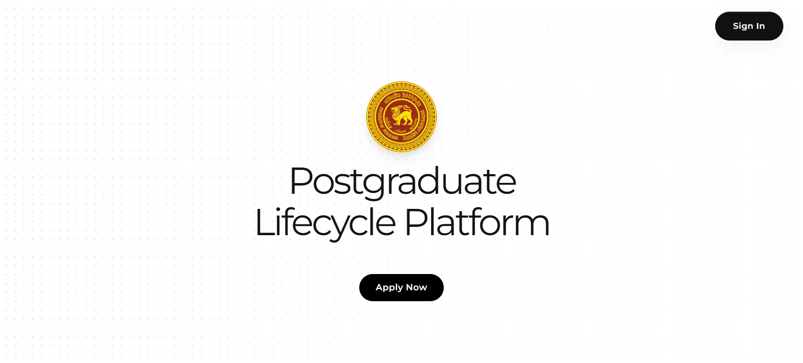
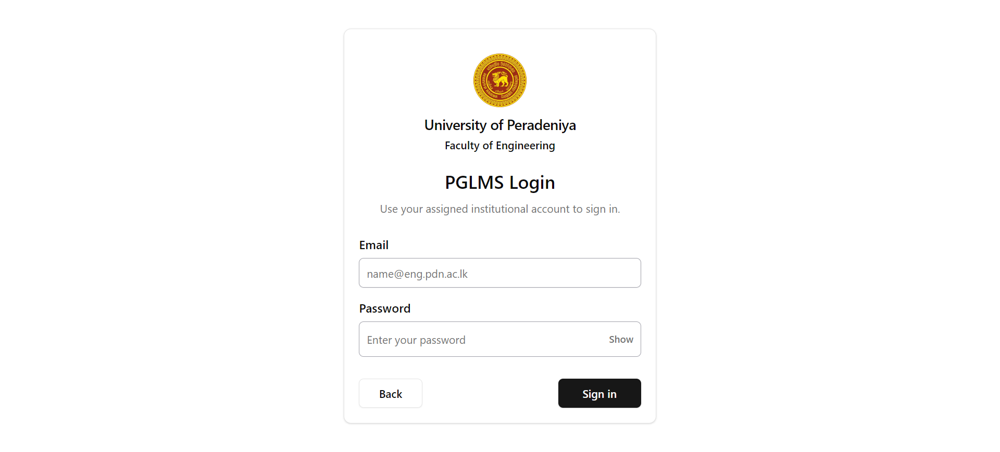
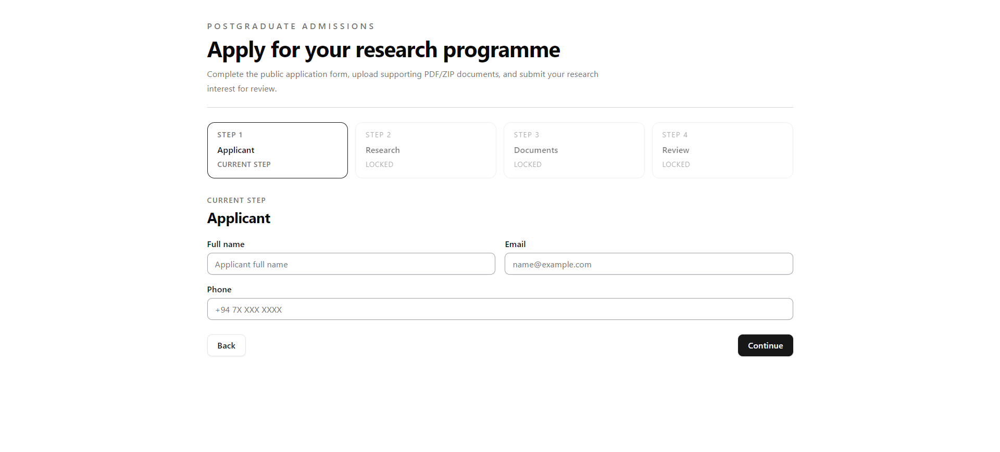
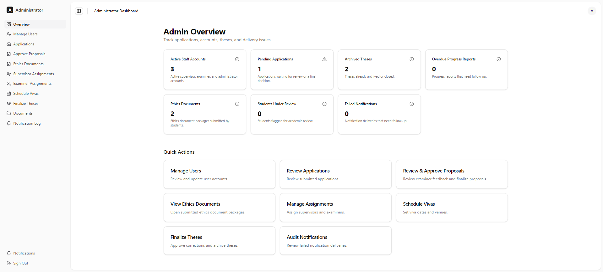
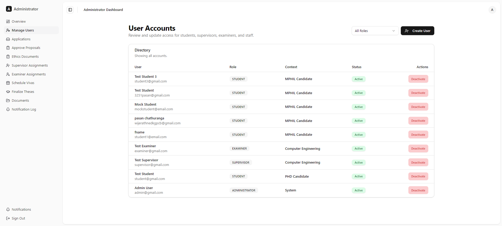

# Postgraduate Lifecycle Management System (PGLMS)

> A centralized, role-aware web platform automating and managing the complete MPhil and PhD academic lifecycle at the Faculty of Engineering, University of Peradeniya.

---

## 📌 Executive Summary

The **Postgraduate Lifecycle Management System (PGLMS)** replaces fragmented paper forms, spreadsheets, and email chains with a unified digital platform. Designed for high transparency and accountability, PGLMS orchestrates every phase of research degrees—from initial public applications and student admissions to supervisor assignments, proposal evaluations, progress monitoring, viva scheduling, thesis defense, and degree finalization.

---

## 🚀 Key Features & Core Capabilities

- **End-to-End Candidate Lifecycle Tracking**: Full digital auditing from application to graduation and record archiving.
- **Role-Based Access & Security**: Custom dashboards tailored specifically for Students, Supervisors, Examiners, and Administrators.
- **Public Admissions Portal**: Online application submission with encrypted upload handling for academic transcripts and identity documentation.
- **Automated Registration Management**: Expiry tracking, active status verification, and automated renewal reminder notifications.
- **Milestone & Progress Monitoring**: Standardized submission workflows for progress reports, research proposals, ethics approvals, and thesis drafts.
- **Examination & Viva Orchestration**: Panel formation, examiner assignment, viva Voce scheduling, and defense outcome recording.
- **Secure Private Document Repository**: Time-limited signed URL downloads via Supabase Storage for sensitive candidate files.
- **Omnichannel Communication**: In-app real-time notification drawer coupled with automated SMTP email delivery via Nodemailer.

---

## 🖼️ Visual Tour & User Interfaces

Below is a showcase of the key user interfaces implemented across the PGLMS platform:

### 1. Public Landing & Information Portal
The gateway providing prospective research students and faculty members with platform information and direct access to admissions.



---

### 2. Authentication & Access Control
Secure multi-factor authentication powered by Firebase Auth, enforcing role-based authorization rules across all system features.



---

### 3. Postgraduate Application & Admission System
Prospective MPhil and PhD candidates can complete multi-step applications, select research areas, and upload supporting documents.



---

### 4. Administrative Oversight Dashboard
An institutional command center offering real-time analytics on candidate counts, pending approvals, active registrations, and upcoming viva schedules.



---

### 5. User Management & Account Provisioning
Administrators can verify incoming applications, manage role permissions, assign academic credentials, and maintain candidate directories.



---

## 👥 User Roles & Workflow Responsibilities

| Role | Core Workflow Responsibilities |
|---|---|
| 🎓 **Student** | Submit research proposals, periodic progress reports, thesis drafts, and corrections; track registration validity and milestone status. |
| 👨‍🏫 **Supervisor** | Oversee assigned research candidates, evaluate progress reports, sign off on submissions, and participate in academic review panels. |
| 🔍 **Examiner** | Review submitted thesis documentation, inspect candidate research outputs, and submit formal viva examination evaluations. |
| ⚡ **Administrator** | Manage prospective applications, provision accounts, handle supervisor/examiner assignments, schedule vivas, and manage system settings. |

---

## 🛠️ System Architecture & Technology Stack

PGLMS is architected as a modern, decoupled full-stack web application leveraging the **Next.js 14 App Router** framework.

```text
                             ┌──────────────────────────────────┐
                             │   React / Next.js App Router     │
                             │      (Client & Server Pages)     │
                             └─────────────────┬────────────────┘
                                               │
                                               ▼
                             ┌──────────────────────────────────┐
                             │    Zod Validated API Handlers    │
                             └────────┬─────────────────┬───────┘
                                      │                 │
              ┌───────────────────────┘                 └───────────────────────┐
              ▼                                                                 ▼
┌───────────────────────────┐    ┌───────────────────────────┐    ┌───────────────────────────┐
│     Firebase Admin SDK    │    │      Prisma ORM (Data)    │    │      Supabase Storage     │
│   (Auth & Token Verif.)   │    │  (PostgreSQL Database)    │    │     (Private Documents)   │
└───────────────────────────┘    └───────────────────────────┘    └───────────────────────────┘
```

### Technology Breakdown

| Component Layer | Technologies Used |
|---|---|
| **Frontend Framework** | Next.js 14 (App Router), React 18, TypeScript |
| **UI Component Library** | Tailwind CSS, Radix UI Primitives, Lucide Icons, SWR |
| **Backend & APIs** | Next.js Route Handlers, Zod Validation |
| **Database & ORM** | PostgreSQL (Supabase Hosted), Prisma ORM |
| **Authentication** | Firebase Authentication & Firebase Admin SDK |
| **Object Storage** | Supabase Storage (Private Buckets & Signed URLs) |
| **Email Delivery** | Nodemailer with SMTP Integration |
| **Monitoring & Telemetry** | Sentry SDK |
| **Testing Suite** | Vitest, React Testing Library, Playwright E2E |

---

## 🧪 Testing & Quality Assurance

To ensure system reliability, operational security, and workflow correctness, PGLMS maintains an extensive test suite:

- **Unit Testing**: Business rule validation, schema parsing, and data transformer logic evaluated using Vitest.
- **Integration Testing**: Route handler authorization, Prisma database interactions, and notification dispatch workflows.
- **Component Testing**: UI component state rendering, form interactions, and accessibility compliance.
- **End-to-End (E2E) Testing**: Full browser lifecycle simulations powered by Playwright covering student application submission, administrative approval, and login flows.

---

## 📄 Project Documentation & Registers

Detailed project specifications, architecture audit reports, and technical workflow registers:

- 📋 [Master System Audit & Progress Register](./PGLMS_MASTER_SYSTEM_AUDIT_AND_PROGRESS_REGISTER.md)
- 🔄 [Workflow Implementation Report](./WORKFLOW_REPORT.md)
- 📖 [Project Overview Specification](https://github.com/cepdnaclk/e23-co2060-MPhil-PhD-Lifecycle-Management-System/blob/main/PROJECT_OVERVIEW.md)

---

## 👨‍💻 Project Team & Supervision

### Development Team

| E-Number | Name | Email |
|---|---|---|
| **E/23/442** | D.K.G.P.C.B. Wijerathne | [e23442@eng.pdn.ac.lk](mailto:e23442@eng.pdn.ac.lk) |
| **E/23/118** | D.A.A. Gunawardana | [e23118@eng.pdn.ac.lk](mailto:e23118@eng.pdn.ac.lk) |
| **E/23/178** | S.N.R. Kodituwakku | [e23178@eng.pdn.ac.lk](mailto:e23178@eng.pdn.ac.lk) |
| **E/23/023** | M.N.P.V. Aththanayake | [e23023@eng.pdn.ac.lk](mailto:e23023@eng.pdn.ac.lk) |

### Academic Supervision

- **Supervisor**: Dr. Upul Jayasinghe ([upul@eng.pdn.ac.lk](mailto:upul@eng.pdn.ac.lk))

---

## 🔗 Quick Links

- [GitHub Code Repository](https://github.com/cepdnaclk/e23-co2060-MPhil-PhD-Lifecycle-Management-System)
- [PGLMS Project Web Page](https://cepdnaclk.github.io/e23-co2060-MPhil-PhD-Lifecycle-Management-System/)
- [Department of Computer Engineering](https://www.ce.pdn.ac.lk/)
- [Faculty of Engineering, University of Peradeniya](https://eng.pdn.ac.lk/)
- [University of Peradeniya](https://www.pdn.ac.lk/)
