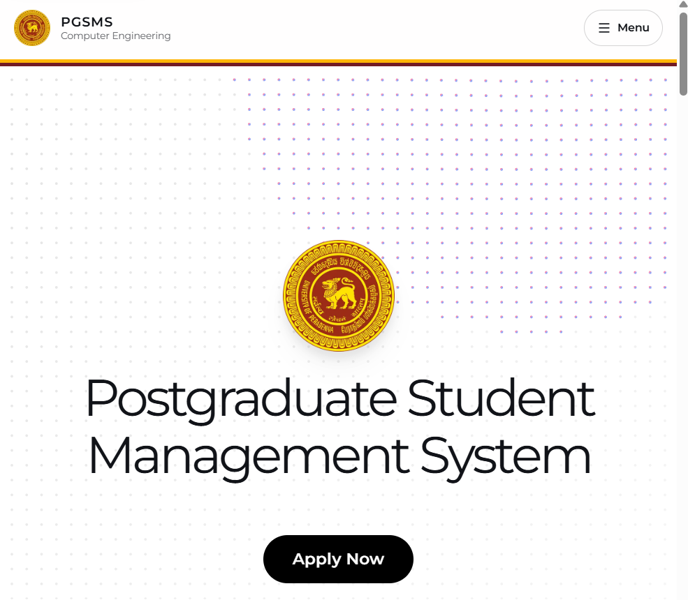
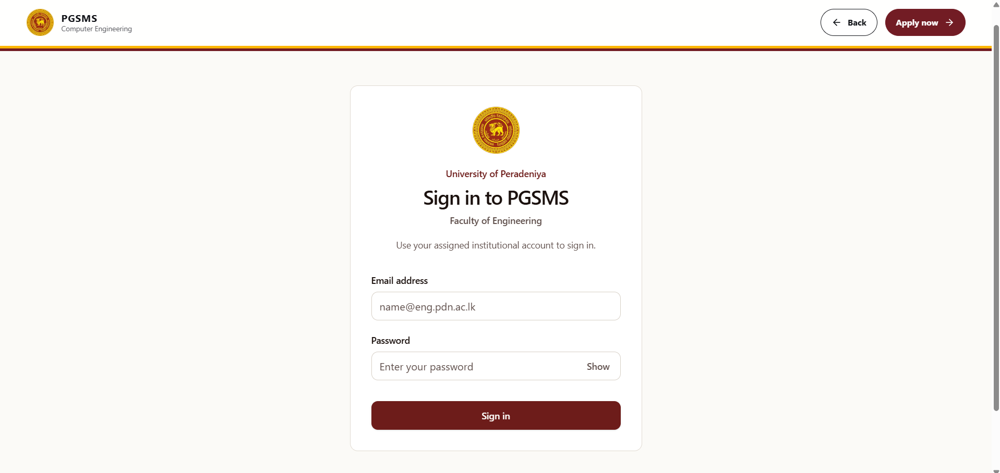
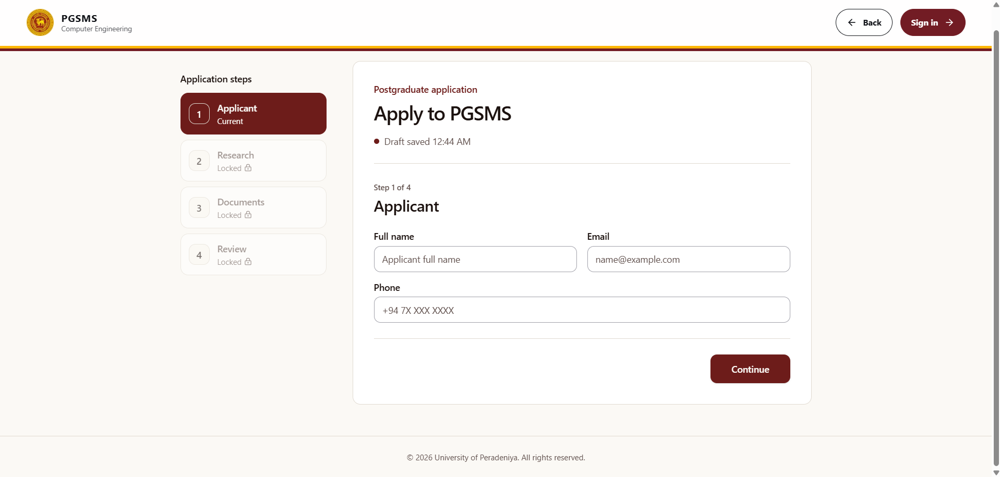
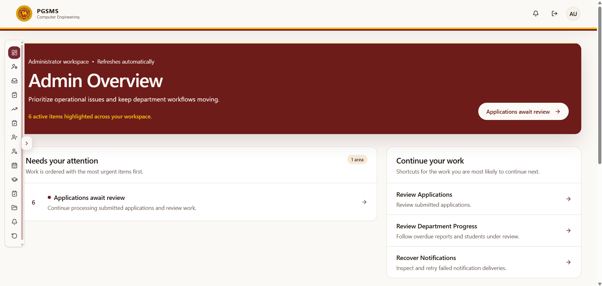
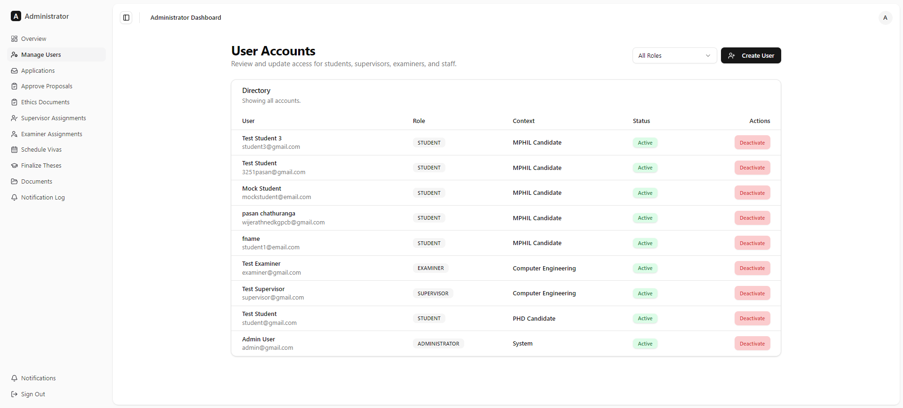

# Postgraduate Lifecycle Management System

The Postgraduate Lifecycle Management System (PGLMS) supports the MPhil and PhD academic lifecycle at the Faculty of Engineering, University of Peradeniya. It provides role-based workflows for applications, admissions, supervision, progress monitoring, thesis examination, and programme completion.

## Overview

PGLMS consolidates processes that would otherwise rely on paper forms, spreadsheets, and email. The system maintains a consistent record of decisions, submissions, assignments, and supporting documents throughout a candidate's programme.

The platform covers:

- Public applications and admission review
- Student registration and programme milestones
- Supervisor and examiner assignments
- Research proposal and ethics workflows
- Progress-report submission and review
- Thesis submission, examination, and corrections
- Viva scheduling and outcome recording
- Completion, graduation, and record archiving
- In-app and email notifications

## Users and Responsibilities

| Role | Primary responsibilities |
|---|---|
| Student | Submit proposals, progress reports, ethics declarations, theses, and corrections; monitor programme milestones and decisions. |
| Supervisor | Review assigned students, provide recommendations, assess progress reports, and certify academic submissions. |
| Examiner | Access assigned thesis material and submit examination or viva recommendations. |
| Head of Department | Confirm academic decisions, examiner assignments, ethics outcomes, viva outcomes, and programme completion. |
| Administrator | Review applications, manage users, coordinate assignments, schedule vivas, maintain records, and monitor system activity. |

## Interface Overview

### Public landing page

The public landing page introduces the system and provides access to applications and authentication.



### Authentication

Firebase Authentication provides identity verification, while server-side authorization restricts access according to the user's assigned role.



### Application portal

Prospective candidates can complete a structured application and upload the required supporting documents.



### Administration dashboard

The administration dashboard summarizes active candidates, pending decisions, registrations, and examination activity.



### User management

Authorized administrators can provision accounts, assign roles, and maintain user records.



## Architecture

PGLMS is implemented as a full-stack Next.js application. Client and server components communicate with validated route handlers, which integrate with the system's authentication, database, storage, email, and monitoring services.

| Area | Technology |
|---|---|
| Application framework | Next.js 16 with the App Router |
| User interface | React 19, TypeScript, Tailwind CSS, Radix UI, and Lucide |
| API and validation | Next.js Route Handlers and Zod |
| Database | PostgreSQL hosted on Supabase |
| Data access | Prisma ORM |
| Authentication | Firebase Authentication and Firebase Admin SDK |
| Document storage | Private Supabase Storage buckets with signed URLs |
| Email | Nodemailer over SMTP |
| Monitoring | Sentry |
| Testing | Vitest, React Testing Library, and Playwright |

### Request flow

```text
Browser
  |
  v
Next.js application
  |
  v
Validated route handlers
  |
  +-- Firebase Authentication
  +-- Prisma and Supabase PostgreSQL
  +-- Supabase Storage
  +-- SMTP email delivery
  +-- Sentry monitoring
```

## Security and Data Handling

- Role checks protect authenticated routes and operations.
- Firebase tokens are verified on the server.
- Application input is validated before processing.
- Sensitive documents are stored in private buckets and accessed through time-limited signed URLs.
- Academic decisions and workflow transitions are retained for audit purposes.

## Testing

The repository includes several levels of automated testing:

- Unit tests for business rules, validation, and data transformations
- Integration tests for database-backed workflows
- Component tests for rendering and user interaction
- Playwright end-to-end tests for complete user journeys
- Static analysis through ESLint and TypeScript
- Dependency auditing through npm

See the main [project README](../README.md) for setup instructions and the complete command reference.

## Project Documentation

- [Master System Audit and Progress Register](./PGLMS_MASTER_SYSTEM_AUDIT_AND_PROGRESS_REGISTER.md)
- [Workflow Implementation Report](./WORKFLOW_REPORT.md)
- [Project Overview](../PROJECT_OVERVIEW.md)
- [Repository documentation index](./)

## Project Team

| Registration number | Name | Email |
|---|---|---|
| E/23/442 | D.K.G.P.C.B. Wijerathne | [e23442@eng.pdn.ac.lk](mailto:e23442@eng.pdn.ac.lk) |
| E/23/118 | D.A.A. Gunawardana | [e23118@eng.pdn.ac.lk](mailto:e23118@eng.pdn.ac.lk) |
| E/23/178 | S.N.R. Kodituwakku | [e23178@eng.pdn.ac.lk](mailto:e23178@eng.pdn.ac.lk) |
| E/23/023 | M.N.P.V. Aththanayake | [e23023@eng.pdn.ac.lk](mailto:e23023@eng.pdn.ac.lk) |

### Academic supervision

Dr. Upul Jayasinghe — [upul@eng.pdn.ac.lk](mailto:upul@eng.pdn.ac.lk)

## Related Links

- [Source repository](https://github.com/cepdnaclk/e23-co2060-MPhil-PhD-Lifecycle-Management-System)
- [Project website](https://cepdnaclk.github.io/e23-co2060-MPhil-PhD-Lifecycle-Management-System/)
- [Department of Computer Engineering](https://www.ce.pdn.ac.lk/)
- [Faculty of Engineering](https://eng.pdn.ac.lk/)
- [University of Peradeniya](https://www.pdn.ac.lk/)
