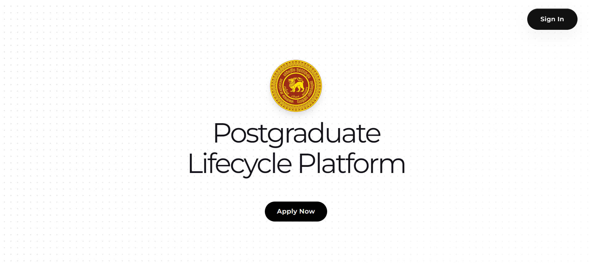
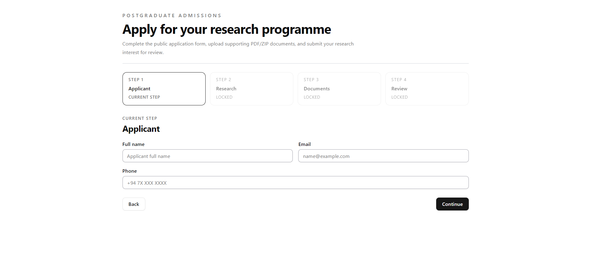
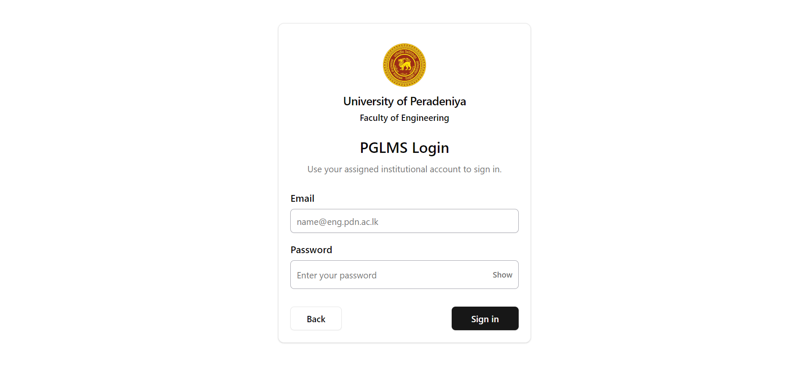

# MPhil/PhD Lifecycle Management System User Guide

**Organization:** Department of Computer Engineering, Faculty of Engineering, University of Peradeniya  
**Document version:** 1.0  
**Application version:** 0.1.0  
**Publication date:** 25 September 2026  
**Document status:** Draft for operational verification  
**Intended audience:** Applicants, Students, Supervisors, Examiners, the PG Coordinator, and the Head of Department

## Document control

| Item | Value |
|---|---|
| Document title | MPhil/PhD Lifecycle Management System User Guide |
| System | Postgraduate Student Management System (PGSMS) |
| Document version | 1.0 |
| Application version | 0.1.0 |
| Publication date | 25 September 2026 |
| Document owner | Needs verification |
| Status | Draft for operational verification |

## Table of contents

- [1. About this guide](#1-about-this-guide)
- [2. System overview](#2-system-overview)
- [3. User roles and permissions](#3-user-roles-and-permissions)
- [4. Prerequisites and access](#4-prerequisites-and-access)
- [Part I - Tutorials](#part-i---tutorials)
  - [5. Follow the application-to-admission journey](#5-follow-the-application-to-admission-journey)
  - [6. Learn the authenticated workspace](#6-learn-the-authenticated-workspace)
- [Part II - How-to guides](#part-ii---how-to-guides)
  - [7. Complete public and common tasks](#7-complete-public-and-common-tasks)
  - [8. Complete Student tasks](#8-complete-student-tasks)
  - [9. Complete Supervisor tasks](#9-complete-supervisor-tasks)
  - [10. Complete Examiner tasks](#10-complete-examiner-tasks)
  - [11. Complete PG Coordinator tasks](#11-complete-pg-coordinator-tasks)
  - [12. Complete HOD tasks](#12-complete-hod-tasks)
- [Part III - Reference](#part-iii---reference)
  - [13. Navigation reference](#13-navigation-reference)
  - [14. Application field reference](#14-application-field-reference)
  - [15. Programme and milestone reference](#15-programme-and-milestone-reference)
  - [16. Status reference](#16-status-reference)
  - [17. Document and upload reference](#17-document-and-upload-reference)
  - [18. Notifications and messages](#18-notifications-and-messages)
- [Part IV - Explanations](#part-iv---explanations)
  - [19. Understand the lifecycle](#19-understand-the-lifecycle)
  - [20. Understand permissions and academic authority](#20-understand-permissions-and-academic-authority)
  - [21. Understand versions and evidence](#21-understand-versions-and-evidence)
- [22. Troubleshooting](#22-troubleshooting)
- [23. Frequently asked questions](#23-frequently-asked-questions)
- [24. Security, privacy, and responsible use](#24-security-privacy-and-responsible-use)
- [25. Accessibility guidance](#25-accessibility-guidance)
- [26. Glossary](#26-glossary)
- [27. Known limitations and items needing verification](#27-known-limitations-and-items-needing-verification)
- [28. Revision history](#28-revision-history)

## 1. About this guide

### 1.1 Purpose

This guide explains how to use PGSMS across the Department-owned MPhil and PhD lifecycle. It covers public applications, admission, authenticated role workspaces, progress milestones, ethics, thesis examination, corrections, completion, graduation, and archive.

### 1.2 Scope

PGSMS supports MPhil and PhD programmes in full-time and part-time study modes. It does not manage fees, leave, extensions, programme transfers, withdrawals, readmission, registration renewal, annual review panels, Faculty Board, Senate, or multi-department processes.

### 1.3 Conventions

- **Bold text** identifies a visible interface label.
- `Code-style text` identifies a status or system value.
- A **Note** provides useful context.
- A **Caution** identifies an action that can cause a recoverable problem.
- A **Warning** identifies a privacy, security, data-loss, or irreversible decision risk.
- Screenshot placeholders identify authenticated screens that require capture in a protected demonstration environment.

## 2. System overview

PGSMS is a role-based academic workflow system. It keeps applications, submissions, assignments, decisions, documents, notifications, and lifecycle status in one auditable platform.

The public landing page provides access to applications and sign-in, as shown in Figure 1.

*Figure 1: PGSMS public landing page*

The implemented lifecycle is:

1. A public applicant submits an application and proposal evidence.
2. The PG Coordinator begins review.
3. The proposed Supervisor records consent or decline.
4. The PG Coordinator assigns at least one Examiner to the current proposal version.
5. Every assigned Examiner completes an independent review.
6. The HOD approves, requests revision, or rejects the application.
7. The PG Coordinator executes an approved admission.
8. The Student completes proposal, ethics, and fixed progress work.
9. The Student requests thesis readiness; the primary Supervisor certifies it and the HOD approves examination readiness.
10. The Student submits a verified thesis version.
11. The PG Coordinator proposes Examiners and the HOD confirms assignments.
12. Confirmed Examiners submit independent reports and viva recommendations.
13. The PG Coordinator schedules the viva and the HOD records the final outcome.
14. If corrections are required, the Student submits a new correction version for the required reviews and HOD closure.
15. The HOD approves academic completion.
16. The PG Coordinator executes completion, records externally confirmed graduation, and later archives the lifecycle record.

## 3. User roles and permissions

*Table 1: User roles and principal responsibilities*

| Role | Principal responsibilities | Important restriction |
|---|---|---|
| Public applicant | Prepare and submit an application; respond to a protected revision request | Does not receive an authenticated Student workspace until admission is executed |
| Student | Submit proposals, ethics information, progress reports, a thesis, and ordered corrections; monitor released status | Cannot change programme, study mode, enrolment date, milestone labels, or milestone dates |
| Supervisor | Record proposed-Supervisor consent; monitor assigned Students; review ethics, progress, readiness, and corrections | Cannot access unassigned candidates |
| Examiner | Review an exactly assigned proposal or thesis version; submit independent evidence and recommendations | Role membership alone does not grant candidate access; one Examiner cannot see another Examiner's confidential draft |
| Administrator / PG Coordinator | Operate applications, accounts, assignments, schedules, records, reports, completion, notifications, and archive | Cannot manufacture HOD academic approval |
| Head of Department (HOD) | Make Department academic decisions for admission, ethics, examination, viva outcomes, corrections, and completion | Does not perform routine operational account or scheduling work |

> **Warning:** Decisions shown as HOD actions are academic decisions. Do not share an HOD account or ask the PG Coordinator to perform an HOD-only action.

## 4. Prerequisites and access

### 4.1 Public applicants

Prepare:

- A working email address and telephone number.
- The intended programme and study mode.
- A research area, proposal title, abstract, and statement of purpose.
- A proposed Supervisor selected from the available list.
- At least one supporting PDF or ZIP file.

Each public-application attachment must be 10 MB or smaller. A submission may contain up to 10 attachments.

### 4.2 Authenticated users

You need:

- An active institutional account provisioned in PGSMS.
- The email address associated with that account.
- Your account password.
- An active role matching the workspace you need.
- A modern browser with cookies and JavaScript enabled.

> **Note:** Examiner and Supervisor access also depends on an active assignment. Having the role alone does not expose every candidate.

# Part I - Tutorials

## 5. Follow the application-to-admission journey

**What you will learn:** How an application moves from public submission to an admitted Student record.  
**Participants:** Applicant, proposed Supervisor, Examiner, PG Coordinator, and HOD.  
**Prerequisites:** The PG Coordinator, proposed Supervisor, Examiner, and HOD must have active accounts.

### 5.1 Submit the public application

1. Open the public landing page.
2. Select **Apply Now**.
3. Complete the four application steps: **Applicant**, **Research**, **Documents**, and **Review**.
4. Confirm that the information is correct.
5. Select **Submit application**.
6. Wait for the success page before closing the browser.

The first application step is shown in Figure 2.

*Figure 2: Public application form at the Applicant step*

### 5.2 Complete Department review

1. The PG Coordinator opens **Applications** and starts the review.
2. The named proposed Supervisor opens **Application Work** and records **Consent** or **Decline**.
3. After consent, the PG Coordinator assigns an active Examiner to the current proposal version.
4. The assigned Examiner opens **Assigned Proposals**, selects a decision, enters independent comments, and selects **Submit independent review**.
5. After all assigned current-version reviews are complete, the HOD opens **Admission Decisions**.
6. The HOD records **Approve**, **Request revision**, or **Reject**, with a reason.
7. If approved, the PG Coordinator executes admission.

**Result:** Admission creates the Student account, registration, fixed milestone schedule, Supervisor assignment, audit records, and notification intents.

> **Caution:** The HOD decision remains unavailable until proposed-Supervisor consent and every required current-version Examiner review are complete.

### 5.3 Complete a requested revision

If the HOD requests a proposal revision, the applicant receives a protected, time-limited revision link.

1. Open the protected link from the Department message.
2. Confirm that the application and revision request are yours.
3. Replace the requested proposal information and documents.
4. Submit the new version.
5. Wait for the Department to complete review of the new version.

**Result:** The new proposal becomes the current version, and review assignments are bound to that exact version.

## 6. Learn the authenticated workspace

**What you will learn:** How to sign in, use the dashboard shell, read notifications, and sign out.  
**Applicable roles:** Student, Supervisor, Examiner, PG Coordinator, and HOD.  
**Prerequisite:** An active account.

### 6.1 Sign in

1. Open the PGSMS landing page.
2. Select **Sign In**.
3. Enter your institutional **Email** and **Password**.
4. Select **Sign in**.
5. Confirm that your role-specific **Overview** page opens.

The sign-in page is shown in Figure 3.

*Figure 3: PGSMS sign-in page*

> **Caution:** If another person's workspace appears, select **Sign Out** immediately and notify the system administrator.

### 6.2 Navigate the workspace

1. Use **Overview** to review status cards and quick actions.
2. Use the **Workspace** navigation items to open role-specific functions.
3. Select **Notifications** to review new workflow messages.
4. Use the profile menu to review your displayed identity and role.
5. Select **Sign Out** when you finish.

> [Screenshot required: current authenticated Overview page using anonymized data, showing the Workspace navigation, At a glance cards, Quick actions, Notifications, profile control, and Sign Out action. Capture one role only and identify the role in the figure title.]

# Part II - How-to guides

## 7. Complete public and common tasks

### 7.1 Submit an application

**Role:** Public applicant  
**Prerequisites:** Application information and at least one PDF or ZIP supporting document.

1. Select **Apply Now** on the public landing page.
2. In **Applicant**, enter **Full name**, **Email**, and **Phone**.
3. Select **Continue**.
4. In **Research**, select **Programme** and **Study mode**.
5. Enter **Research area**, select **Proposed supervisor**, and enter **Proposal title**, **Proposal abstract**, and **Statement of purpose**.
6. Select **Continue**.
7. In **Documents**, select the file input and upload 1 to 10 PDF or ZIP files. Ensure each file is 10 MB or smaller.
8. Select **Continue**.
9. In **Review**, verify every value and attached filename.
10. Select the confirmation checkbox.
11. Select **Submit application**.

**Expected result:** The application success page appears and the application enters `SUBMITTED` status.

**Common errors:**

- A name shorter than three characters is rejected.
- A telephone number must contain 7 to 15 digits and may use spaces, hyphens, parentheses, and a leading plus sign.
- The proposal title must contain at least five characters.
- The proposal abstract must contain at least 20 characters.
- A proposed Supervisor and at least one document are required.

### 7.2 Sign in and sign out

**Role:** Any authenticated role  
**Prerequisite:** Active account credentials.

1. Open **Sign In** from the landing page.
2. Enter **Email** and **Password**.
3. Select **Sign in**.
4. Complete your work.
5. Select **Sign Out** from the workspace navigation.

**Expected result:** Your authenticated session ends and protected pages are no longer available.

### 7.3 Review notifications

**Role:** Any authenticated role

1. Select **Notifications** in the workspace sidebar.
2. Read unread items and follow a permitted destination when an action link is available.
3. Return to your workspace after reviewing the message.

**Expected result:** You understand the action or status change that requires attention.

## 8. Complete Student tasks

### 8.1 Submit or revise a research proposal

**Role:** Student  
**Prerequisites:** Active registration and a proposal submission state that permits a new version.

1. Open **Proposals**.
2. Enter **Proposal Title** and **Abstract**.
3. Under **Document Upload**, choose 1 to 10 PDF or ZIP files.
4. Wait for the upload to finish.
5. Select **Submit Proposal** for the first version or **Submit Revision** for a permitted new version.
6. Review **History** to confirm the version and download availability.

**Expected result:** The current proposal version appears with its status, while older versions remain available as history.

### 8.2 Submit an ethics declaration

**Role:** Student  
**Prerequisites:** Active registration and an approved proposal.

1. Open **Ethics Approval**.
2. In **Ethics Declaration**, choose **Ethics approval required** or **Ethics approval not required**.
3. Enter **Application title** and **Summary**.
4. If approval is required, upload the supporting PDF or ZIP evidence.
5. Select **Submit Declaration and Evidence** or **Submit Declaration**, as displayed.
6. Review **Ethics History** for the recorded revision and workflow status.

**Expected result:** The declaration moves to Supervisor review.

### 8.3 Submit a progress milestone

**Role:** Student  
**Prerequisites:** Active registration and a milestone that is scheduled, due, overdue, or returned.

1. Open **Progress Reports**.
2. Locate the next available milestone.
3. Enter a **Progress narrative** of at least 20 characters.
4. If this is a returned version, complete **What changed**.
5. Optionally add PDF or ZIP supporting evidence.
6. Select the displayed submit or resubmit action.
7. Confirm that the milestone version appears in its history.

**Expected result:** The milestone becomes submitted and waits for the active primary Supervisor.

> **Note:** Milestone labels and due dates are generated by the programme schedule and cannot be edited by the Student.

### 8.4 Request thesis readiness

**Role:** Student  
**Prerequisites:** Approved proposal, all required milestones complete, and the Department ethics gate satisfied.

1. Open **Thesis Submission**.
2. Review the criteria in **Thesis readiness**.
3. Enter an optional **Message to primary Supervisor**.
4. Select **Request Thesis Readiness**.
5. Wait for primary-Supervisor certification and HOD approval.

**Expected result:** The request becomes available to the primary Supervisor. Thesis submission remains locked until the HOD approves examination readiness.

### 8.5 Submit a thesis

**Role:** Student  
**Prerequisite:** Readiness status `HOD_APPROVED`.

1. Open **Thesis Submission**.
2. Enter **Thesis title** and **Abstract**.
3. Under **Thesis Document**, choose 1 to 10 PDF or ZIP files.
4. Select **Submit thesis**.
5. Review **Thesis record** to confirm the current version.

**Expected result:** A verified thesis version is created with status `SUBMITTED`.

### 8.6 Submit ordered thesis corrections

**Role:** Student  
**Prerequisite:** An HOD correction order in `ORDERED` or `RETURNED` status.

1. Open **Corrections**.
2. Review the correction **Type**, Examiner-review requirement, due date, and requirements.
3. In **Response to requirements**, explain how every correction was addressed. Enter at least 20 characters.
4. Under **Corrected thesis and response package**, choose the corrected PDF or ZIP files.
5. Select **Submit corrected package** or **Resubmit corrected package**.
6. Review **Version and review history**.

**Expected result:** The exact correction version moves to primary-Supervisor certification.

### 8.7 Find and download a document

**Role:** Student

1. Open **Documents**.
2. Search by filename, title, summary, or period.
3. Optionally filter by category, tag, or date.
4. Select the relevant download action.

**Expected result:** PGSMS authorizes the request and provides a short-lived download link when you have access.

## 9. Complete Supervisor tasks

### 9.1 Record proposed-Supervisor consent

**Role:** Supervisor  
**Prerequisite:** The application names you as the proposed Supervisor.

1. Open **Application Work**.
2. Review the applicant and current proposal information.
3. Select **Consent** to accept or **Decline** to refuse.

**Expected result:** The decision is recorded once. A consented application can proceed to Examiner reviewer assignment.

### 9.2 Review assigned Students

**Role:** Supervisor  
**Prerequisite:** Active Supervisor assignment.

1. Open **Student Roster**.
2. Filter by **Program Type** or **Registration Status** when needed.
3. Open a Student record to review registration, milestones, proposal, and related work.

**Expected result:** Only Students within your active assignment scope are shown.

### 9.3 Evaluate an authenticated Student proposal

**Role:** Supervisor  
**Prerequisite:** The proposal belongs to an assigned Student and is available for evaluation.

1. Open **Monitor Proposals**.
2. Select the proposal.
3. Review the current proposal version and documents.
4. Enter evaluation feedback of at least 10 characters.
5. Select the available evaluation decision and submit it.

**Expected result:** The evaluation is recorded against the proposal version.

### 9.4 Recommend or return an ethics declaration

**Role:** Assigned Supervisor

1. Open **Ethics Recommendations**.
2. Review the Student's applicability, summary, and evidence.
3. Enter **Decision notes**.
4. Select **Recommend** or **Return to Student**.

**Expected result:** A recommended declaration moves to PG Coordinator recording; a returned declaration can be revised by the Student.

### 9.5 Approve or return a progress report

**Role:** Active primary Supervisor

1. Open **Monitor Reports**.
2. Review the submitted milestone narrative and evidence.
3. Enter feedback.
4. Select the approval action to complete the milestone, or select the return action to request a new version.

**Expected result:** Approval completes the milestone; return preserves the reviewed version and reopens submission.

### 9.6 Certify or return thesis readiness

**Role:** Active primary Supervisor

1. Open **Thesis Readiness**.
2. Locate the Student request.
3. Verify the displayed checklist: approved proposal, completed fixed milestones, satisfied ethics gate, and examination copy readiness.
4. Enter Supervisor notes.
5. Select the certification action or return the request.

**Expected result:** Certification makes the request available for HOD examination-readiness approval.

### 9.7 Certify or return corrections

**Role:** Active primary Supervisor

1. Open **Correction Reviews**.
2. Review the correction order, Student response, and exact submitted documents.
3. Enter review notes.
4. Certify the version or return it with a reason.

**Expected result:** A certified minor-correction version advances to the next required decision. When Examiner review is required, it advances to the assigned Examiner.

## 10. Complete Examiner tasks

### 10.1 Review an assigned application proposal

**Role:** Assigned Examiner  
**Prerequisite:** An active assignment to the current application proposal version.

1. Open **Assigned Proposals**.
2. Review the applicant, proposal version, abstract, and permitted documents.
3. Select **Approved**, **Revision required**, or **Rejected**.
4. Enter independent review comments of at least 10 characters.
5. Select **Submit independent review**.

**Expected result:** The assignment becomes complete. The HOD can decide only after every required current-version assignment is complete.

### 10.2 Submit an independent thesis report

**Role:** Confirmed, exact-version Examiner  
**Prerequisites:** Confirmed thesis assignment and access to the assigned viva workspace.

1. Open **Assigned Vivas**.
2. Review the candidate, thesis version, and viva information.
3. Download the thesis using the available document action.
4. Under **Independent thesis report**, select a report recommendation.
5. Enter a **Report** of at least 20 characters.
6. Attach exactly one **Formal report PDF**.
7. Submit the report.

**Expected result:** The independent report, recommendation, and formal PDF are recorded against your exact assignment.

### 10.3 Submit a viva recommendation

**Role:** Confirmed Examiner  
**Prerequisite:** Your independent thesis report and formal report PDF are complete.

1. Remain in **Assigned Vivas**.
2. Select **Recommendation**.
3. Enter a **Rationale** of at least 20 characters.
4. Select the submit action.
5. Review the confirmation dialog and confirm.

**Expected result:** Your recommendation is recorded independently. It does not itself set the final viva outcome.

### 10.4 Review required corrections

**Role:** Assigned thesis Examiner  
**Prerequisites:** Examiner review is required and the primary Supervisor has certified the current correction version.

1. Open **Correction Reviews**.
2. Review the HOD order, Student response, revised thesis, and compliance documents.
3. Enter review notes.
4. Approve the version or return it with a reason.

**Expected result:** An approved version advances to HOD correction closure; a returned version reopens Student submission.

## 11. Complete PG Coordinator tasks

### 11.1 Start application review and assign an Examiner

**Role:** Administrator / PG Coordinator

1. Open **Applications**.
2. Select the submitted application and start its completeness review.
3. Confirm that the proposed Supervisor has recorded consent.
4. Assign an active Examiner to the current proposal version.
5. Monitor assignment completion.

**Expected result:** The application becomes ready for an HOD decision only after all required current-version reviews are complete.

### 11.2 Execute an approved admission

**Role:** Administrator / PG Coordinator  
**Prerequisite:** HOD decision `APPROVED`.

1. Open the approved application in **Applications**.
2. Review the decision and admission prerequisites.
3. Select the admission-execution action.
4. Confirm the newly created Student and registration records.

**Expected result:** PGSMS creates one active registration, fixed milestones, role relationships, audit events, and notification intents.

### 11.3 Manage user accounts

**Role:** Administrator / PG Coordinator

1. Open **Manage Users**.
2. Filter by role when needed.
3. Use **Create User** only for an authorized operational need.
4. Use **Deactivate** when access must be removed without deleting audit history.

> **Warning:** Deactivation affects access. Verify the selected person and role before confirming.

### 11.4 Record Department ethics status

**Role:** Administrator / PG Coordinator  
**Prerequisite:** Supervisor recommendation complete.

1. Open **Ethics Documents**.
2. Review the declaration, evidence, and decision history.
3. Choose **Approved**, **Rejected**, or **Exempt** as permitted.
4. Enter **Approval reference** when the status is Approved.
5. Enter **Decision notes**.
6. Select **Record for HOD** or **Return**.

**Expected result:** The proposed Department status moves to HOD confirmation or returns for correction.

### 11.5 Assign Supervisors and propose Examiners

**Role:** Administrator / PG Coordinator

1. Use **Supervisor Assignments** to create or maintain authorized Student-Supervisor relationships.
2. Use **Examiner Assignments** after a verified thesis is submitted.
3. Bind each proposed Examiner to the exact current thesis version.
4. Wait for HOD confirmation before treating the assignment as active.

### 11.6 Schedule or reschedule a viva

**Role:** Administrator / PG Coordinator  
**Prerequisite:** Thesis status `UNDER_EXAMINATION`.

1. Open **Schedule Vivas**.
2. Select the thesis.
3. Enter **Defense Date**, time, and **Venue/Link**.
4. Select **Schedule Viva**.

**Expected result:** The viva schedule is recorded and notification intents are created.

### 11.7 Monitor progress and reports

**Role:** Administrator / PG Coordinator

1. Open **Department Progress**.
2. Filter or review the Department-wide progress tables.
3. Export the permitted CSV when an operational report is required.
4. Follow up on overdue or incomplete milestones without changing Student-controlled schedule fields.

### 11.8 Execute completion, graduation, and archive

**Role:** Administrator / PG Coordinator  
**Prerequisites:** HOD completion approval and all displayed gates satisfied.

1. Open **Completion Records**.
2. Execute approved programme completion.
3. After receiving external confirmation, record the graduation date and reference.
4. Archive the lifecycle record only after graduation is recorded.
5. Enter an archive reason when requested.

**Expected result:** Completion updates the Student, registration, thesis, audit, and notification records atomically. Graduation and archive remain separate later actions.

### 11.9 Review notification delivery and recover failures

**Role:** Administrator / PG Coordinator

1. Open **Notification Log** to review delivery records.
2. Open **Notification Recovery** to inspect failed or dead-letter items.
3. Verify that the underlying cause has been corrected.
4. Use the retry action only for an authorized recoverable delivery.

> **Caution:** Retrying can send a message again. Confirm the recipient, event, and current workflow state first.

## 12. Complete HOD tasks

### 12.1 Decide an application

**Role:** HOD  
**Prerequisites:** Proposed-Supervisor consent and all required current-version Examiner reviews complete.

1. Open **Admission Decisions**.
2. Review the application, consent, proposal version, and independent reviews.
3. Select **Approve**, **Request revision**, or **Reject**.
4. Enter the decision reason.
5. Review and confirm the academic decision.

**Expected result:** Approval permits PG Coordinator admission execution; revision creates a protected applicant revision path; rejection is terminal.

### 12.2 Confirm, return, or reject ethics status

**Role:** HOD  
**Prerequisite:** PG Coordinator record complete.

1. Open **Ethics Confirmations**.
2. Review the declaration, evidence, Supervisor recommendation, Coordinator record, and history.
3. Enter **Decision notes**.
4. Select **Confirm**, **Return to Coordinator**, or **Reject**.

**Expected result:** Only confirmed Approved or Exempt status satisfies the thesis ethics gate.

### 12.3 Approve or return thesis readiness

**Role:** HOD  
**Prerequisite:** Primary-Supervisor certification.

1. Open **Examination Decisions**.
2. Under **Examination readiness**, review the request and certification evidence.
3. Enter HOD notes.
4. Approve the request or return it.

**Expected result:** Approval unlocks Student thesis submission.

### 12.4 Confirm or decline an Examiner assignment

**Role:** HOD  
**Prerequisite:** PG Coordinator proposed assignment to the exact current thesis version.

1. Open **Examination Decisions**.
2. Under **Examiner confirmations**, review the candidate, Examiner, thesis version, and assignment information.
3. Select **Confirm** or **Decline**.

**Expected result:** A confirmed Examiner receives exact-version access. The first accepted assignment changes the thesis to `UNDER_EXAMINATION`.

### 12.5 Record the final viva outcome

**Role:** HOD  
**Prerequisites:** At least two confirmed Examiners and complete independent report, formal report PDF, and viva recommendation evidence for every confirmed Examiner.

1. Open **Examination Decisions**.
2. Under **Viva outcomes**, review all independent evidence.
3. Select **Pass**, **Minor corrections**, **Major corrections**, or **Fail**.
4. Enter an outcome rationale of at least 10 characters.
5. Review the decision and record the final outcome.

**Expected result:** The HOD outcome becomes the authoritative Department viva outcome.

### 12.6 Issue and close corrections

**Role:** HOD

1. For a minor- or major-corrections outcome, open the correction-order action.
2. Enter correction requirements of at least 20 characters.
3. Set whether assigned-Examiner review is required. Major corrections require Examiner review.
4. Issue the order.
5. After required reviews are complete, review the exact current correction version.
6. Approve correction completion or return the version.

**Expected result:** Approval changes the thesis to `CORRECTIONS_APPROVED`; return preserves history and opens a new Student version.

### 12.7 Approve academic completion

**Role:** HOD  
**Prerequisites:** All milestones complete, ethics gate confirmed, current thesis evidence verified, viva passed or corrections closed, and no unresolved correction order.

1. Open **Completion Decisions**.
2. Review the completion dossier and every displayed gate.
3. Confirm that the approval is bound to the exact current thesis version.
4. Select the completion-approval action.

**Expected result:** Completion status becomes `HOD_APPROVED`, allowing PG Coordinator execution.

# Part III - Reference

## 13. Navigation reference

*Table 2: Role workspace navigation*

| Role | Workspace items |
|---|---|
| Student | Overview; Proposals; Ethics Approval; Progress Reports; Milestones; Documents; Thesis Submission; Corrections |
| Supervisor | Overview; Student Roster; Application Work; Monitor Proposals; Ethics Recommendations; Monitor Reports; Thesis Readiness; Correction Reviews; Documents |
| Administrator / PG Coordinator | Overview; Manage Users; Applications; Proposal Approvals; Department Progress; Ethics Documents; Supervisor Assignments; Examiner Assignments; Schedule Vivas; Finalize Theses; Completion Records; Documents; Notification Log; Notification Recovery |
| Examiner | Overview; Assigned Proposals; Assigned Vivas; Correction Reviews; Documents |
| HOD | Overview; Admission Decisions; Department Progress; Ethics Confirmations; Examination Decisions; Completion Decisions |

Every authenticated workspace also provides **Notifications**, a profile control, and **Sign Out**.

## 14. Application field reference

*Table 3: Public application fields and validation*

| Step | Field | Requirement |
|---|---|---|
| Applicant | Full name | Required; at least 3 characters |
| Applicant | Email | Required; valid email address |
| Applicant | Phone | Required; 7 to 15 digits; spaces, hyphens, parentheses, and a leading plus sign are permitted |
| Research | Programme | Required; MPhil or PhD |
| Research | Study mode | Required; Full-time or Part-time |
| Research | Research area | Required; at least 2 characters |
| Research | Proposed supervisor | Required; selected from the available active list |
| Research | Proposal title | Required; at least 5 characters |
| Research | Proposal abstract | Required; at least 20 characters |
| Research | Statement of purpose | Required |
| Documents | Supporting documents | 1 to 10 PDF or ZIP files; maximum 10 MB each |
| Review | Confirmation | Required before **Submit application** becomes available |

## 15. Programme and milestone reference

*Table 4: Programme duration and generated milestones*

| Programme | Study mode | Expected duration | Fixed milestones |
|---|---|---:|---:|
| MPhil | Full-time | 24 calendar months | M1-M4 |
| MPhil | Part-time | 36 calendar months | M1-M6 |
| PhD | Full-time | 36 calendar months | M1-M6 |
| PhD | Part-time | 54 calendar months | M1-M9 |

Milestones are created during admission at six-calendar-month offsets from the enrolment timestamp. The Student cannot edit these labels or dates.

## 16. Status reference

### 16.1 Application and admission

- `SUBMITTED`: The public application has been finalized.
- `UNDER_REVIEW`: Department review is active.
- `ADMITTED`: The PG Coordinator executed an HOD-approved admission.
- `REJECTED`: The application will not proceed.
- Supervisor consent: `PENDING`, `CONSENTED`, `DECLINED`, or `WITHDRAWN`.
- Department decision: `PENDING`, `APPROVED`, `REVISION_REQUIRED`, or `REJECTED`.

### 16.2 Progress

- `SCHEDULED`: The milestone exists but is not yet the active due item.
- `DUE`: Submission is available.
- `SUBMITTED`: A version waits for primary-Supervisor review.
- `RETURNED`: The Student must submit a new version.
- `APPROVED`: The milestone is complete.
- `OVERDUE`: The due date has passed without completion.
- `WAIVED`: The milestone does not require completion.

### 16.3 Thesis readiness and thesis

- Readiness: `PENDING`, `REQUESTED`, `CERTIFIED`, `HOD_APPROVED`, `RETURNED`, or `REVOKED`.
- Thesis: `SUBMITTED`, `UNDER_EXAMINATION`, `CORRECTIONS_REQUIRED`, `CORRECTIONS_APPROVED`, `COMPLETED`, `ARCHIVED`, or `CLOSED`.

### 16.4 Viva and corrections

- Viva outcome: `PASS`, `MINOR_CORRECTIONS`, `MAJOR_CORRECTIONS`, or `FAIL`.
- Correction order: `ORDERED`, `SUBMITTED`, `RETURNED`, `SUPERVISOR_CERTIFIED`, `EXAMINER_APPROVED`, or `COMPLETION_APPROVED`.

### 16.5 Completion

- Completion: `PENDING`, `HOD_APPROVED`, or `COMPLETED`.
- Academic status: `ACTIVE`, `UNDER_REVIEW`, `COMPLETED`, `GRADUATED`, `ARCHIVED`, or `FAILED`.
- Registration: `ACTIVE`, `COMPLETED`, or `ARCHIVED`.

## 17. Document and upload reference

PGSMS accepts PDF and ZIP document types for general staged uploads. Public-application attachments are limited to 10 MB each. Authenticated staged uploads are limited to 50 MB each and to 10 files per version unless a stricter screen-specific rule applies.

The independent Examiner report requires exactly one PDF file.

Document categories include application attachments, proposals, ethics approvals, progress reports, theses, corrections, and review attachments.

> **Caution:** Do not rename a file to `.pdf` or `.zip` without converting it to the correct format. PGSMS verifies the document type and may reject an invalid file.

## 18. Notifications and messages

PGSMS can create in-app notifications and email delivery intents after important committed workflow events. A notification may include a permitted dashboard destination.

Messages do not replace the authoritative status displayed in the relevant workspace. If an email and the dashboard disagree, stop and ask the PG Coordinator to verify the record.

# Part IV - Explanations

## 19. Understand the lifecycle

The lifecycle separates academic decisions from operational execution. For example, the HOD approves admission, but the PG Coordinator creates the Student account and registration. The HOD records the viva outcome, but the PG Coordinator schedules the viva. The HOD approves completion, but the PG Coordinator executes completion and later records graduation and archive.

This separation protects academic authority while ensuring that operational work remains traceable.

## 20. Understand permissions and academic authority

PGSMS checks both role and relationship. A Supervisor sees assigned Students. An Examiner sees only candidates attached to an explicit proposal or thesis assignment. A Student sees their own released information. The PG Coordinator has Department-wide operational scope, while the HOD has Department academic decision scope.

Archived records remain available for authorized review but expose no new lifecycle mutations.

## 21. Understand versions and evidence

Submissions are versioned so that a review stays attached to the exact evidence that was reviewed. A returned progress report, proposal, thesis, or correction package does not overwrite the reviewed version. Instead, the Student submits a new version.

Examiner assignments are bound to an exact thesis version and document manifest. Completion approval is also bound to the exact verified current thesis version. This prevents a later file replacement from silently changing the evidence behind an academic decision.

## 22. Troubleshooting

### 22.1 Sign-in fails

**Symptom:** The sign-in page reports an authentication or access error.  
**Likely cause:** Incorrect credentials, inactive local account, mismatched role, or unavailable authentication service.  
**Resolution:** Re-enter the assigned email and password. If the error continues, contact the PG Coordinator and provide your email address, role, time of the attempt, and the displayed error. Never send your password.

### 22.2 A workspace or candidate is missing

**Symptom:** A Supervisor or Examiner cannot see an expected candidate.  
**Likely cause:** No active assignment, assignment bound to another version, or the preceding decision is incomplete.  
**Resolution:** Ask the PG Coordinator to verify the assignment and current version. Do not request broad candidate access.

### 22.3 An application cannot proceed to HOD decision

**Symptom:** The HOD decision action is unavailable.  
**Likely cause:** Proposed-Supervisor consent is incomplete, no Examiner is assigned, or at least one current-version review is incomplete.  
**Resolution:** Complete each prerequisite in order and refresh **Admission Decisions**.

### 22.4 A file upload fails

**Symptom:** PGSMS rejects or cannot finish an upload.  
**Likely cause:** Unsupported type, excessive size, too many files, interrupted upload, or verification failure.  
**Resolution:** Use PDF or ZIP, remain within the displayed limits, upload again, and wait for completion before submitting the form.

### 22.5 Thesis submission is locked

**Symptom:** Thesis fields or the submit action are unavailable.  
**Likely cause:** Readiness has not reached `HOD_APPROVED`.  
**Resolution:** Check **Thesis readiness**. Complete Student request, primary-Supervisor certification, and HOD approval in that order.

### 22.6 A thesis is missing from Schedule Vivas

**Symptom:** The PG Coordinator cannot select a submitted thesis.  
**Likely cause:** The thesis has not reached `UNDER_EXAMINATION`.  
**Resolution:** Propose an Examiner assignment and have the HOD confirm it, then refresh **Schedule Vivas**.

### 22.7 Viva recommendation is blocked

**Symptom:** An Examiner cannot submit a viva recommendation.  
**Likely cause:** The independent thesis report or formal report PDF is incomplete.  
**Resolution:** Submit the independent report and exactly one formal PDF first, refresh if necessary, and then submit the viva recommendation.

### 22.8 HOD outcome is locked

**Symptom:** The HOD cannot record the final viva outcome.  
**Likely cause:** Fewer than two confirmed Examiners have complete evidence, or a confirmed Examiner is missing a report, PDF, or recommendation.  
**Resolution:** Review the missing-evidence list and ask each named Examiner to complete the required item.

### 22.9 Completion is blocked

**Symptom:** Completion approval or execution is unavailable.  
**Likely cause:** An incomplete milestone, unconfirmed ethics gate, missing verified current thesis, incomplete viva/corrections outcome, or unresolved correction order.  
**Resolution:** Review every displayed completion gate and resolve the missing evidence without bypassing the workflow.

## 23. Frequently asked questions

### Can an Administrator approve an application or viva outcome?

No. The HOD records the academic decision. The PG Coordinator performs the permitted operational action after that decision.

### Can an Examiner open every Student record?

No. Examiner access requires an explicit assignment to an exact proposal or thesis version.

### Can a Student change milestone dates?

No. Milestones are generated from programme and study mode during admission.

### Does submitting a revision delete the previous version?

No. Previous versions remain in history so that reviews and decisions retain their evidence.

### Does an Examiner recommendation become the final viva outcome?

No. Examiner recommendations are independent evidence. The HOD records the final Department outcome.

### Is graduation the same as completion?

No. HOD approval and PG Coordinator completion occur first. Graduation is recorded later from external confirmation, and archive is a separate final operation.

## 24. Security, privacy, and responsible use

- Use only your assigned account.
- Do not share passwords or session access.
- Confirm the candidate and version before submitting a decision.
- Upload only documents required for the academic workflow.
- Do not include unnecessary personal or sensitive data in free-text fields.
- Do not forward signed document links; they are short-lived and authorization-scoped.
- Sign out on shared devices.
- Report unexpected access, incorrect role information, or another person's record immediately.
- Do not use browser Back or repeated submission to try to override a completed decision.

## 25. Accessibility guidance

- Use the keyboard to move through links, fields, menus, and buttons.
- Use the **Skip to dashboard content** link when it appears during keyboard navigation.
- Zoom browser content when larger text is required.
- Refer to controls by their visible label rather than position or colour.
- Keep uploaded documents accessible, with selectable text, useful headings, and meaningful filenames where possible.
- If a workflow cannot be completed with assistive technology, report the page, role, control label, and observed problem to the PG Coordinator.

## 26. Glossary

**Academic status:** The Student's overall lifecycle state, such as Active, Completed, Graduated, or Archived.

**Active primary Supervisor:** The Supervisor relationship authorized to perform final progress, readiness, and correction certification actions.

**Archive:** A non-destructive final state that retains documents, decisions, and audit history while preventing new lifecycle changes.

**Current version:** The latest authoritative version of a proposal, thesis, progress report, or correction package.

**Department decision:** An academic decision made by the HOD within the system's Department scope.

**Examiner:** A user who receives candidate access through an explicit proposal or thesis assignment.

**HOD:** Head of Department.

**Manifest:** The recorded set of files and identifying evidence associated with one exact submission version.

**Milestone:** A fixed six-month progress checkpoint generated from programme and study mode.

**PG Coordinator:** The Administrator role responsible for Department operational commands.

**PGSMS:** Postgraduate Student Management System.

**Readiness:** The gated process that must be completed before thesis submission for examination.

**Released information:** Workflow information that the system permits the Student or another role to view.

**Signed URL:** A short-lived document access link issued after authorization.

**Version-bound review:** A review attached to one exact submission version rather than to a changeable general record.

## 27. Known limitations and items needing verification

- **Production URL:** Needs verification. This guide uses visible interface labels rather than a deployment-specific address.
- **Document owner and support contact:** Needs verification.
- **Authenticated screenshots:** Needs verification in a protected staging environment. Current role dashboards and decision screens require anonymized screenshots before final publication.
- **Live integrations:** Production Firebase, Supabase Storage, SMTP, scheduled maintenance, monitoring, backup, and restore behaviour were not verified for this guide.
- **Deployed accessibility:** Automated repository tests exist, but full assistive-technology and authenticated cross-role accessibility verification remains required.
- **Operational release status:** The repository audit dated 24 September 2026 identifies deployment and operations work that must be assessed separately from this user guide.

## 28. Revision history

| Version | Date | Description | Author |
|---|---|---|---|
| 1.0 | 25 September 2026 | Initial repository-derived user guide in Markdown and DOCX formats | OpenAI Codex |
